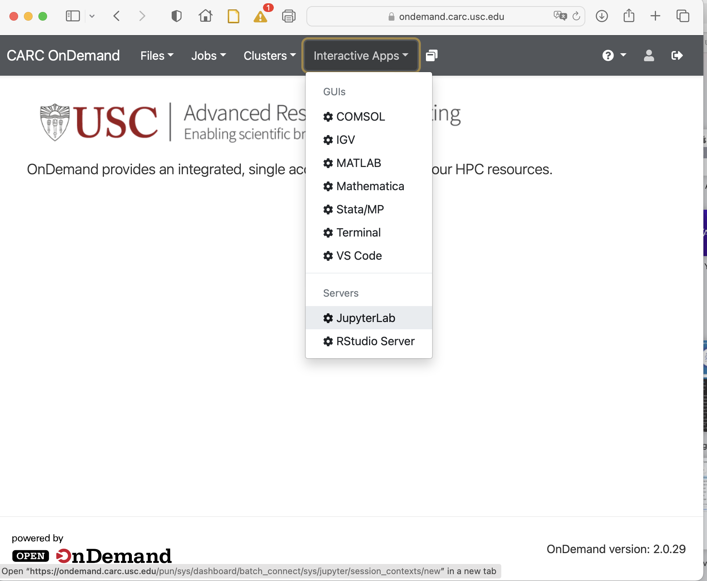
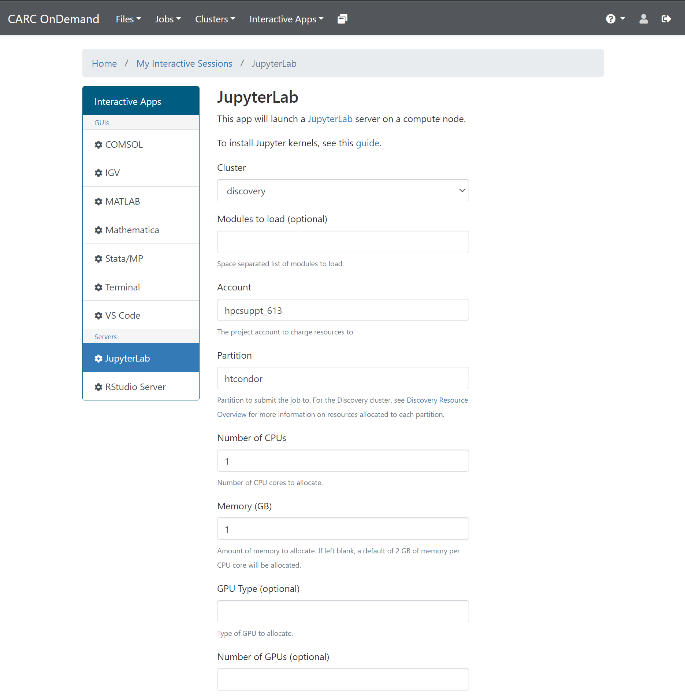
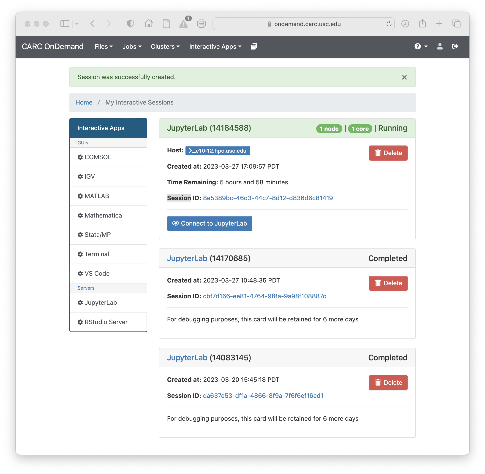
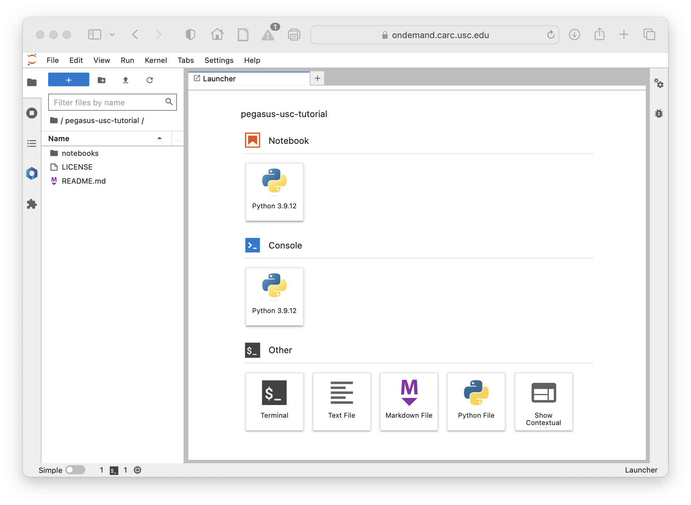

# Pegasus WMS USC Tutorial

This repository contains preconfigured Pegasus Workflows examples including the Pegasus Tutorial, to run on USC CARC Discovery Cluster resources. 

## Getting Started
To get started, use a web browser and log on to USC OnDemand Instance at https://ondemand.carc.usc.edu . You need to be on USC Network and need to your USC credentials to log in. More details on how to logon to USC Open OnDemand can be found at https://www.carc.usc.edu/user-information/user-guides/hpc-basics/getting-started-ondemand

To start a Jupyter notebook server, Click on Interactive Apps and then select JupyterLab.



When launching the Jupyter Lab, it is important to select the following
* For Cluster, specify Discovery
* For Account, specify the account you normally use, like ttrojan_123
* For Partition, specify htcondor
* Set the number of CPUs to 1
* Set Memory to 1GB
* Set the number of hours to 4

For the "Managing workflows on HPC with Pegasus WMS" workshop, please do the above with the following change:
* For Account, specify osinski_982

For the CARC Boot Camp 2023, please do the above with the following change:
* For Account, specify hpcsuppt_613

The above settings are important to ensure you start a JupyterLab Server on a node that has HTCondor installed and preconfigured to submit your workflows



Once your JupyterLab Session starts, Click Connect to JupyterLab button



From there, Click on File -> New and then click on Terminal to get the terminal



Once in the terminal, clone this GitHub Repository

```
$ git clone https://github.com/pegasus-isi/pegasus-usc-tutorial.git
```

In Jupyter, navigate to the example you are interested in, and step through the notebook. 

For first-time users, we highly recommend to do the notebooks in order, as they build up on concepts in the previous notebooks.

