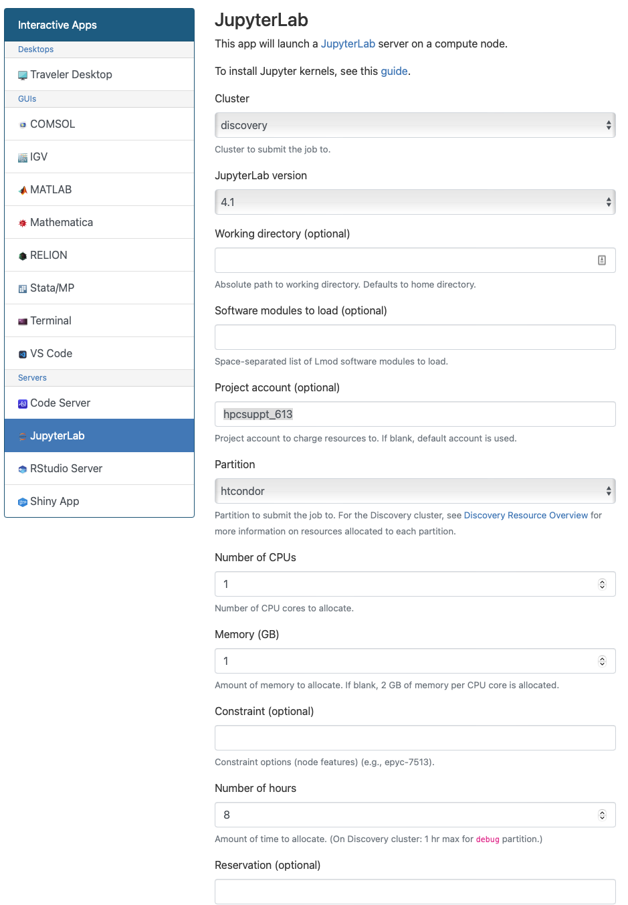

# Pegasus Tutorial for Local HPC Cluster

This repository contains preconfigured Pegasus workflow examples including the Pegasus Tutorial
, to run on a local HPC resource. The tutorial and examples are meant to be launched via Jupyter 
notebooks running on a node, where Pegasus and HTCondor are installed and configured to submit 
workflows to the cluster.

A recommended way to launch Jupyter notebooks is to do via the Open OnDemand install on your
cluster. Instructions on how to get notebooks launched via OOD on the workflow submit node
can be found here **XXX**.

The screenhosts below are representative of the Open OnDemand install at USC CARC cluster.
You can follow these on your local clusters Open OnDemand instance.

## Getting Started

To get started, use a web browser and log on to your cluster's OnDemand Instance. 
Typically the URL is like  https://ondemand.cluster.edu .

To start a Jupyter notebook server, Click on Interactive Apps and then select JupyterLab.


When launching the Jupyter Lab, it is important to select the following correctly.
Your local sys admin can point you to the right values
* For Cluster, specify the local cluster you want to submit to
* For Account, specify the account you normally use, like ttrojan_123
* For Partition, specify the **partition** that maps to the workflow submit node 
* Set the number of CPUs to 1
* Set Memory to 1GB
* Set the number of hours to 4

Please make sure that you specify the correct SLURM partition that maps to the workflow 
submit node. This is to ensure you start a JupyterLab Server on a node
that has HTCondor installed and preconfigured to submit your workflows



Once your JupyterLab Session starts, Click Connect to JupyterLab button


From there, Click on File -> New and then click on Terminal to get the terminal


Once in the terminal, clone this GitHub Repository

```
git clone https://github.com/pegasus-isi/pegasus-usc-tutorial.git
```

In Jupyter, navigate to the example you are interested in, and step through the notebook. 

For first-time users, we highly recommend to do the notebooks in order, as they build up on concepts in the previous notebooks.

